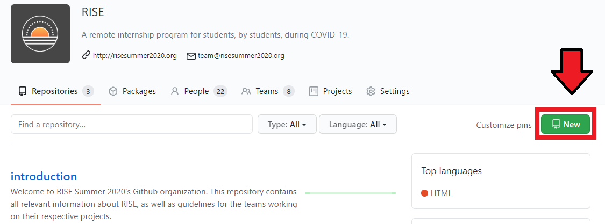
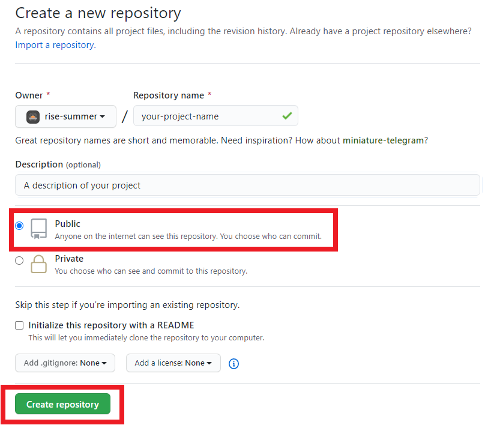
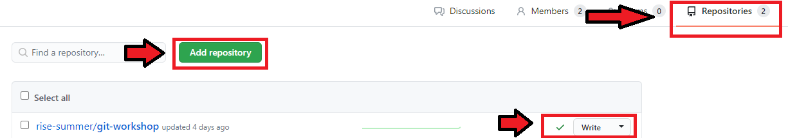
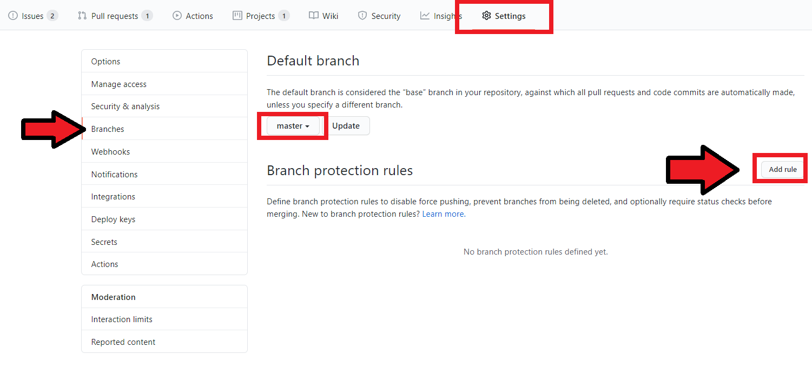
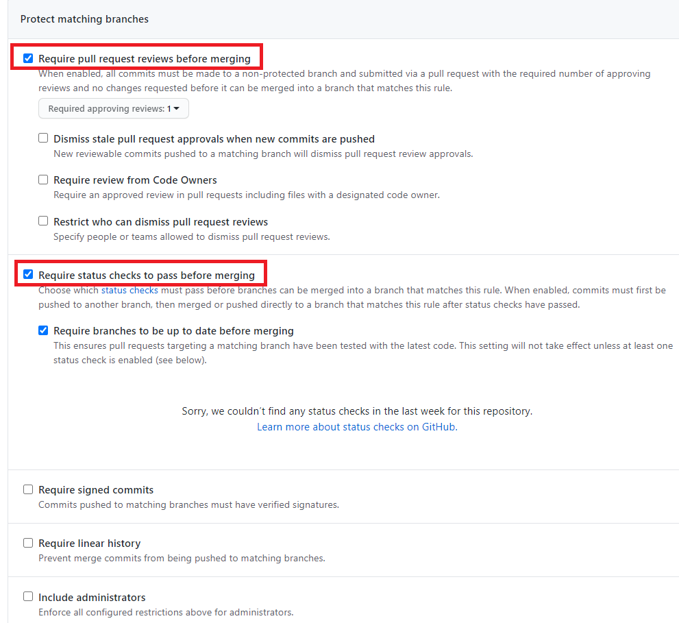

# RISE Summer 2020

 
Welcome to the RISE Github! RISE is a summer program created for students, by students during COVID-19. Our community was born out of the desire to provide an alternative summer opportunity to students who had their internships and jobs canceled due to the global pandemic. For nine weeks (from July 6th to Sep 4th), students will work together in teams as Product Managers, Designers, and Software Engineers. RISE is the community that brought these students together and is providing the support and structure to make sure teams follow through on their projects and have a meaningful summer experience. Learn more at our <a ref="risesummer2020.org">website</a>!

This Github organization contains the code for each of our 7 teams' projects. Each team's individual repositories are monitored by RISE Directors and their respective Engineering Manager(s). Developers are allowed to contribute to repositories and RISE mentors are invited as outside collaborators with read-only access.

# EM Github Guidelines

The following topics of discussion are geared more towards Engineering Managers to help with creating an efficient project workflow. However, they can apply to all developers.

## Create Your Team's Repository

The home page of the RISE Github organization should have a **New** button, which you can use to create a new repository. Once you have done so, there will be instructions on how to set up the repository (linking with local repo, initial commit, etc).

Once you have created and set up your repository, you need to then add it to your team so all your team members have access to the repository as well. The steps to do so from the RISE homepage are as follows:

1. Navigate to the **Teams** tab
1. Select your team
1. Once on the team page, navigate to the **Repositories** tab
1. You can then use the **Add repository** button to add your newly created repo
1. After this, you can manage the permissions of your team using the dropdown next to the repo name

## Branch Protection

To enforce code review and prevent merge mistakes, it is always good to protect your "master" branch. Github lets you do this by allowing you to require approval from other contriibutors before any pull request can be merged.

You can find this option when you navigate to the **Settings** tab of your repository. From here, navigate to **Branches** and you will see a page that looks similar to the one shown in the figure below. Click the **Add rule** button to apply branch rules to your "master" branch.

You will be able to see a list of branch rules now. We recommend enabling the first two rules at the very least:

- Require pull request reviews before merging
  - All pull requests mus tbe approved before they can be merged (by someone other than the person who issued the pull request)
  - You may specify the number of reviewers needed (recommend 1-2)
- Require status checks to pass before merging
  - This allows you to set up automatic extra checks for any pull request
  - The default check is making sure the branch is up to date before merging
  - You can look into integrating other checks, and some packages online exist to add checks to Github pull requests (linters, netlify, etc)

## Issues

## Assigning Issues

## Labeling Issues

## Linking Issues

## Using Projects

## Automating Projects

## Code Style

# General Github Guidelines

The following topics apply to all developers on the team, please take some time to review these to get an idea of good development practices.

## Workflow: Commit Small, Commit Often

## Workflow: One Pull Request per Issue

## Code Review: Assigning Reviewees

## Code Review: Pull Request/Issue Discussion Board
