# RISE Summer 2020

 
Welcome to the RISE Github! RISE is a summer program created for students, by students during COVID-19. Our community was born out of the desire to provide an alternative summer opportunity to students who had their internships and jobs canceled due to the global pandemic. For nine weeks (from July 6th to Sep 4th), students will work together in teams as Product Managers, Designers, and Software Engineers. RISE is the community that brought these students together and is providing the support and structure to make sure teams follow through on their projects and have a meaningful summer experience. Learn more at our <a ref="risesummer2020.org">website</a>!

This Github organization contains the code for each of our 7 teams' projects. Each team's individual repositories are monitored by RISE Directors and their respective Engineering Manager(s). Developers are allowed to contribute to repositories and RISE mentors are invited as outside collaborators with read-only access.

# EM Github Guidelines

The following topics of discussion are geared more towards Engineering Managers to help with creating an efficient project workflow. However, they can apply to all developers.

## Create Your Team's Repository

The home page of the RISE Github organization should have a **New** button, which you can use to create a new repository. Once you have done so, there will be instructions on how to set up the repository (linking with local repo, initial commit, etc).

Once you have created and set up your repository, you need to then add it to your team so all your team members have access to the repository as well. The steps to do so from the RISE homepage are as follows:

1. Navigate to the **Teams** tab
1. Select your team
1. Once on the team page, navigate to the **Repositories** tab
1. You can then use the **Add repository** button to add your newly created repo
1. After this, you can manage the permissions of your team using the dropdown next to the repo name

## Branch Protection

To enforce code review and prevent merge mistakes, it is always good to protect your "master" branch. Github lets you do this by allowing you to require approval from other contriibutors before any pull request can be merged.

You can find this option when you navigate to the **Settings** tab of your repository. From here, navigate to **Branches** and you will see a page that looks similar to the one shown in the figure below. Click the **Add rule** button to apply branch rules to your "master" branch.

You will be able to see a list of branch rules now. We recommend enabling the first two rules at the very least:

- Require pull request reviews before merging
  - All pull requests mus tbe approved before they can be merged (by someone other than the person who issued the pull request)
  - You may specify the number of reviewers needed (recommend 1-2)
- Require status checks to pass before merging
  - This allows you to set up automatic extra checks for any pull request
  - The default check is making sure the branch is up to date before merging
  - You can look into integrating other checks, and some packages online exist to add checks to Github pull requests (linters, netlify, etc)

## Code Style

# General Github Guidelines

The following topics apply to all developers on the team, please take some time to review these to get an idea of good development practices.

## Using Issues

Issues are a great way to create, keep track of, and delegate action items for your project development. All issues are organized on your repository's issue board, available for your whole team to reference at any time.

You can create a new issue with the **New issue** button on the issue board as shown below. Creating a new issue involves creating a headline (which will show up on the board) and an initial, more in depth description of what is needed to resolve the issue. In other words, what task is attached to the issue.

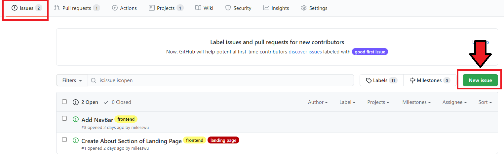

Every issue comes with a discussion board (shown below), where you and your teammates can comment on the issue, update each other on progress, and reach conclusions. The great thing about having this discussion board on Github is that it records the entire lifecycle of the issue, meaning any new team member can understand where the issue started and where it is now just by viewing the discussion board. This removes need for reiterating conclusions amongst team members, meaning syncing up can be done independently.

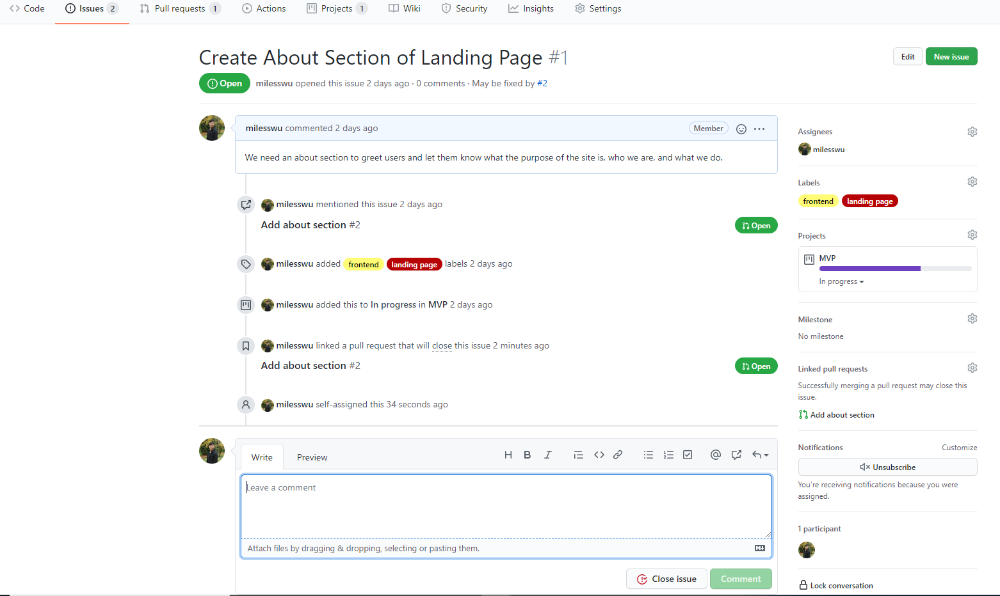

On the sidebar of any issue page, there are also some interesting features that can help with organization. These generally attach extra information to an issue, which further explains its status. They are highlighted and explained below.

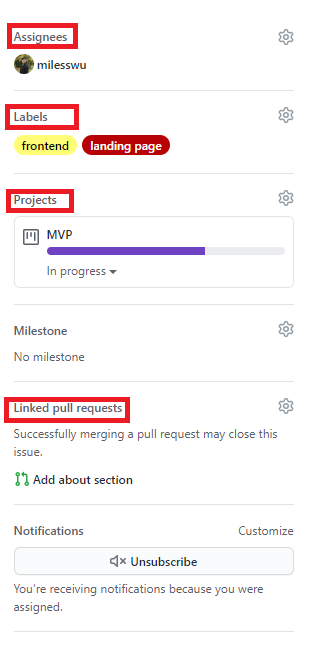

### Assignees

You can delegate tasks to your team members by assigning them to issues. The assignees are indicated on the issue board, allowing all team members to know exactly what their responsibilities are.

### Labels

Labels help categorize your issues, so that team members can get a general idea of what an issue is related to before deciding to look further into it. You can create your own custom labels by clicking the **Labels** button on the issue board.

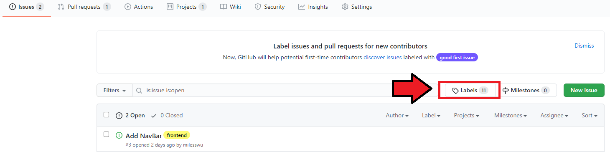

### Projects

An issue can be placed on a project board to indicate what component of the project it is related to. See more about Using Project Boards!

### Linked Pull Requests

Issues can be linked to specific pull requests. Often, this pull request should in some way reference the issue number. Once a pull request is linked to an issue, the issue will automatically be closed when the pull request is merged. See more in One Pull Request per Issue.

## Using Projects

Using project boards is a great way to track your overall progress on the different components of your product. Project boards can often be automated to update as your work progresses, helping with management and gauging "product health."

To create a new Project, navigate to the **Projects** tab of the repository and use the **New project** button. Project names should be succinct and describe a component of your overall product (i.e. MVP, Server API, etc).

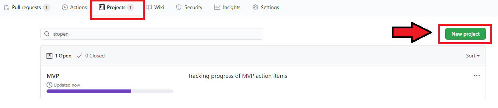

If you have used tools like Trello, you can think of each "Project" you create as a Trello board relating to that component of your overall product. You can see in the below figure that a project board allows you to organize "cards" in different columns.

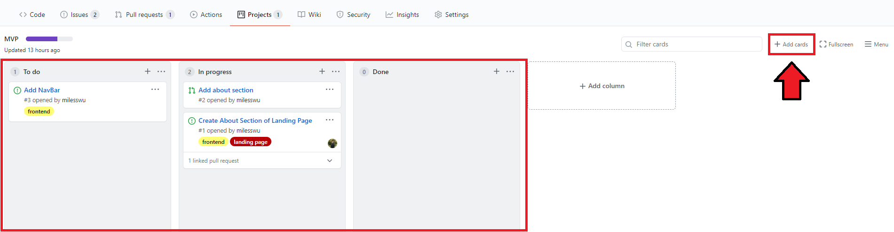

Every card is either an issue or a pull request. By assigning cards to a project, we can associate issues and pull requests with components of the product. Project progress is then tracked based on how many issues/pull requests are left to be done and how many have already been completed.

You can add cards to the project board by using the **Add card** button. Cards can then be dragged over into columns in the project board.

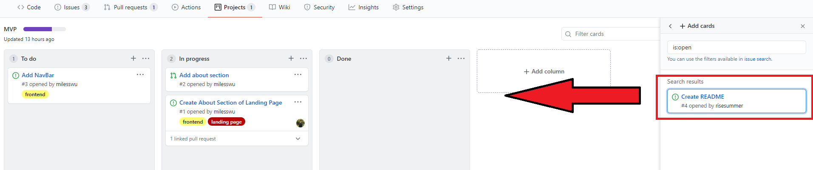

## Automating Project Boards

When creating your project, we recommend you set up your columns to be automated. You can do this by selecting the **Automated kanban** template when creating a new project. When automated, issues/pull requests on your project board will automatically move from column to column depending on the status of the issue/pull request. For example, a pull request in the "In Progress" column, will move to the "Done" column after it is merged and closed.

## Workflow

### Commit Small, Commit Often

Generally, it is good practice to keep all your commits small and self-contained. No commit should ever represent an entire feature. No commit should contain unrelated changes (all changes should deal with a single issue, do not combine two issues into a single commit).

Committing small and often gives you more flexibility when it comes to reverting changes and tracing code history. It also helps with isolating the source of problems in your code.

### One Pull Request per Issue

Generally, every issue should be associated with a pull request. The pull request in question should contain changes that resolve its linked issue(s). Remember to link the pull request with the issue as shown below!

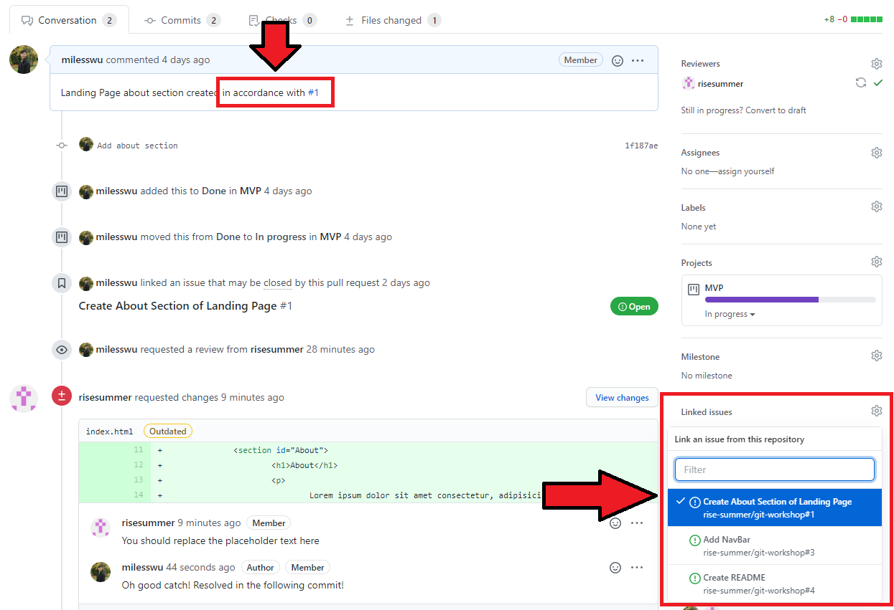

All issues that are linked with the pull request will be automatically closed once the pull request is merged. Note that multiple issues can be linked to a pull request if the pull request contains changes that resolve multiple issues.

Generally though, when tackling a new issue you should create and publish a new branch to later create a pull request to resolve the issue.

## Code Review

### Assigning Reviewees

Whenever you create a pull request for a branch you are working on, you should always assign some reviewees to look over your work. This begins the process of code review. All reviewees will be notified that they have been assigned as a reviewer and can then view your changes and see if you made any mistakes.

### Requesting Changes

As a reviewer, you are able to comment on a pull request and request changes before approving the merge. Do this if you ever catch something that was missed or if you have suggestions for a change to be made.

To start a review and request changes, follow these steps:

1. Add comments to the lines of code that are relevant to your requested changes
1. Click the **Start a review** button
1. You may continue to add comments to other lines of code
1. Once you are done making comments, click the **Finish your review** button
1. Select the **Request changes** option and Submit
1. Now, the pull request will show that some changes are requested

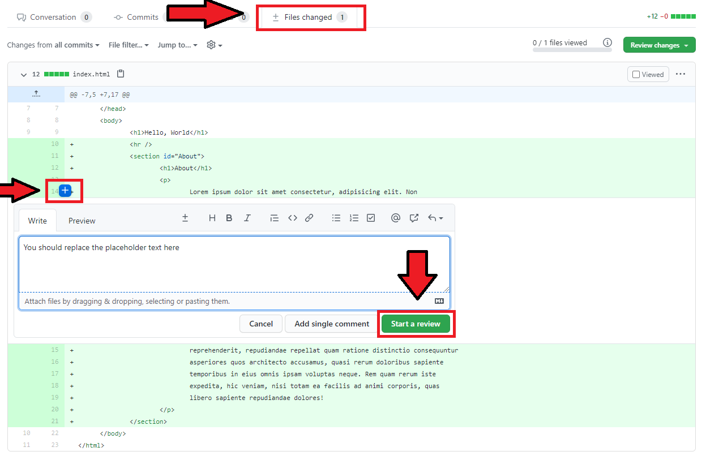
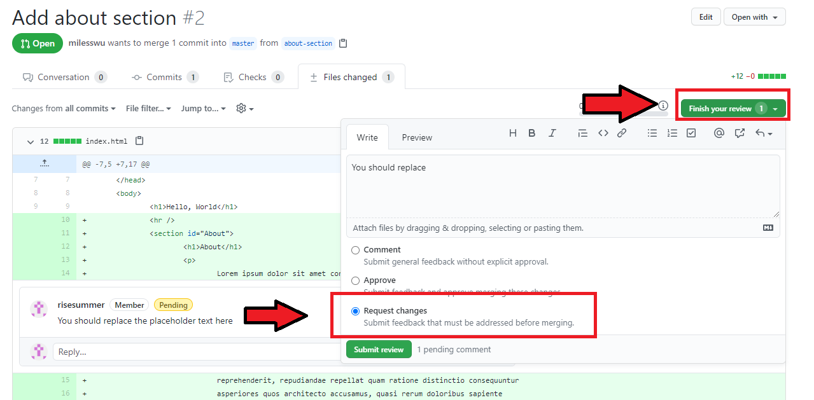
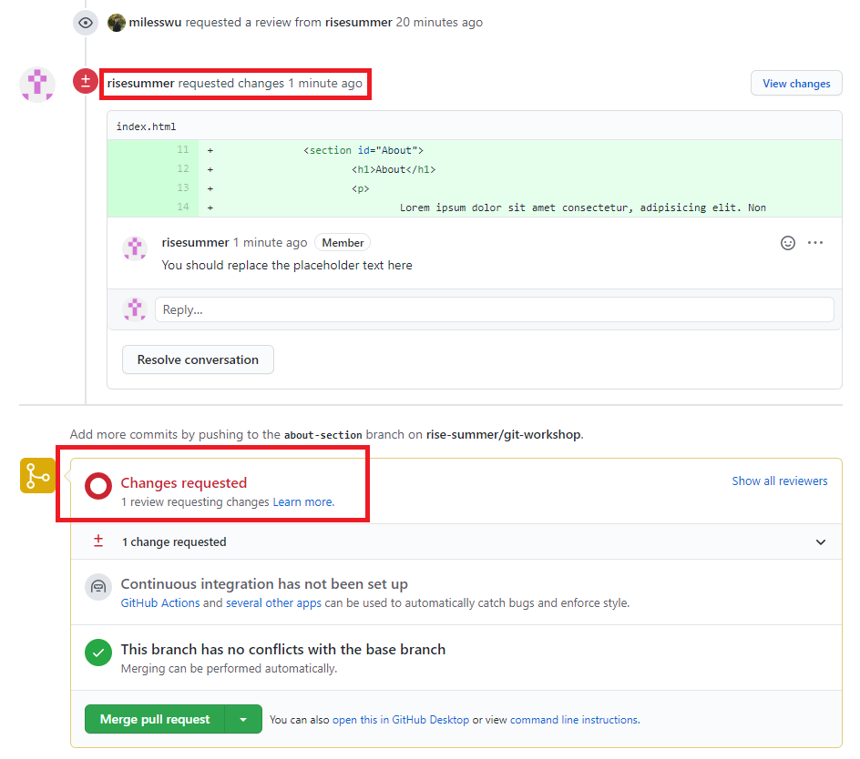

### Responding to Requested Changes

If a reviewer requests changes on your pull request, you should either rebuttal or implement those changes. Once the requested changes are resolved be sure to use the **Resolve conversation** button to indicate that the requested changes have been addressed.

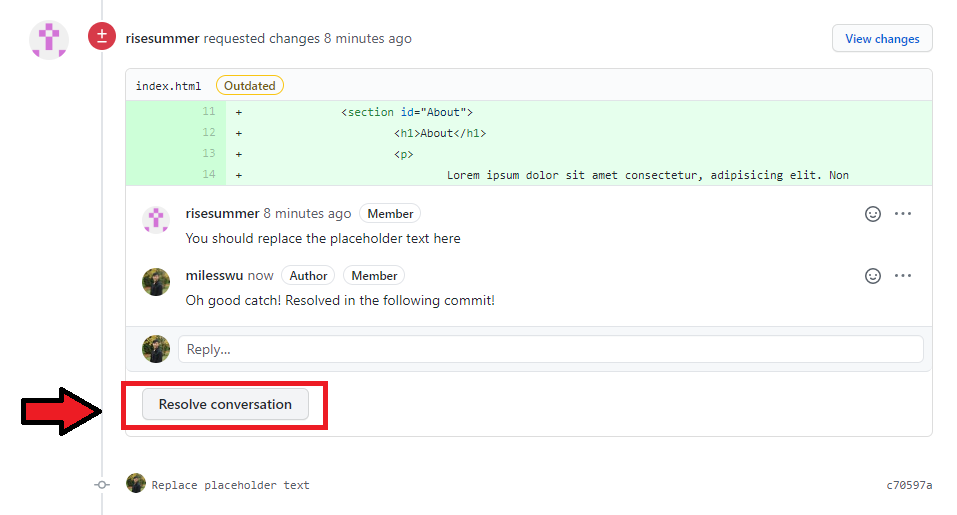

### Approving Changes

Once your requested changes have been addressed, you are free to approve the changes in the pull request. Additionally, if there are no more pending reviewers, you may choose to merge the pull request.

You can approve a pull request's changes using the following steps:

1. Navigate to pull request's **Files changed** tab
1. Click the **Review changes** button
1. Select the **Approve** option and submit
1. The pull request will now show your approval of the pull request

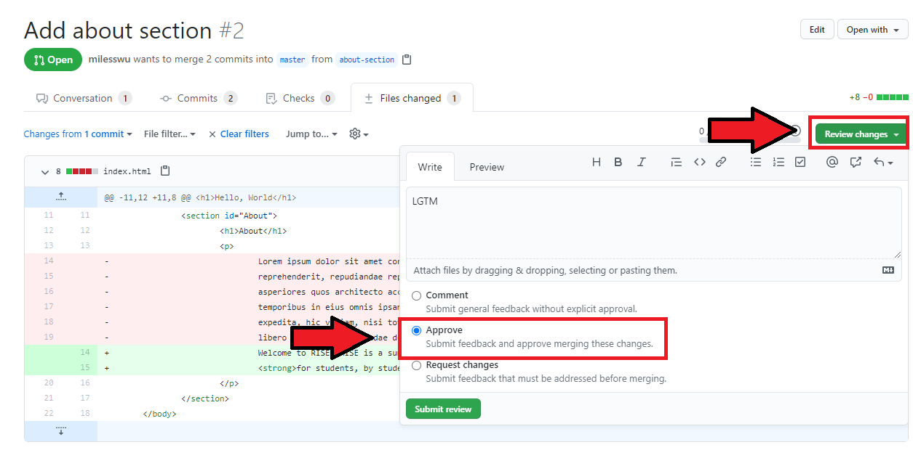
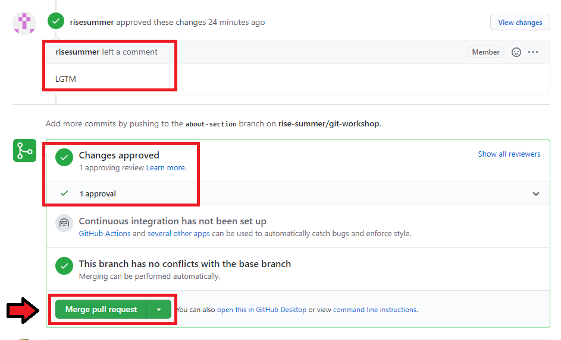
